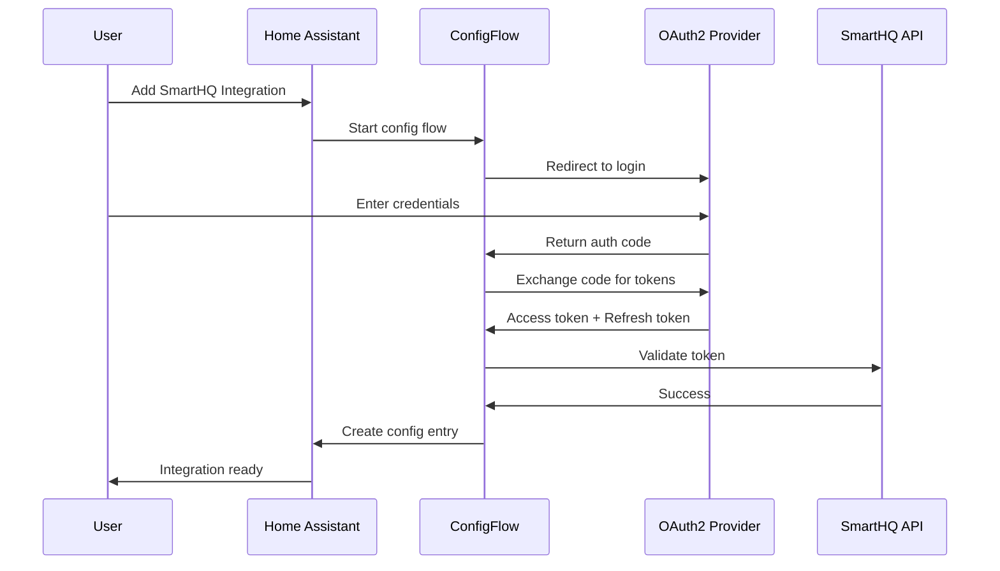
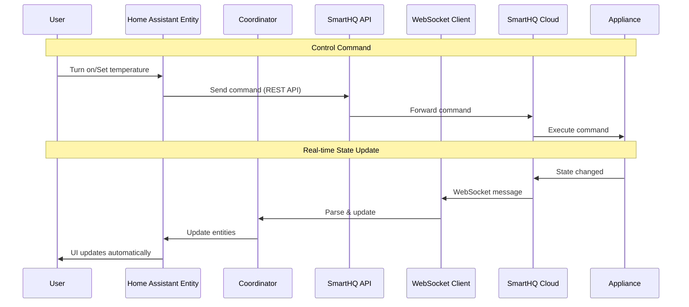
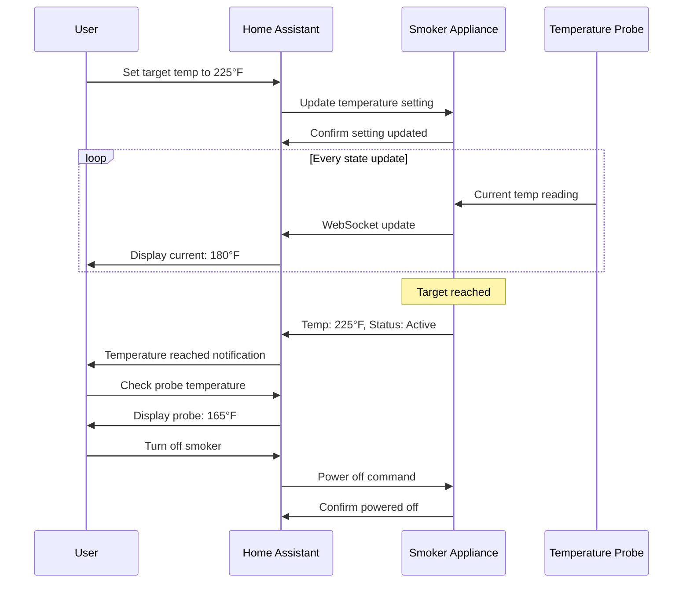
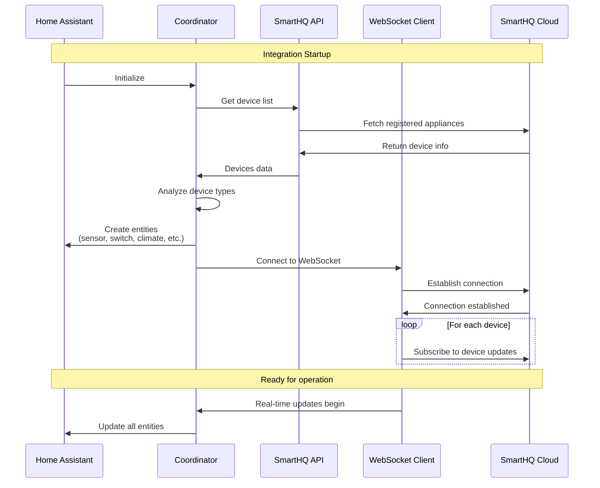
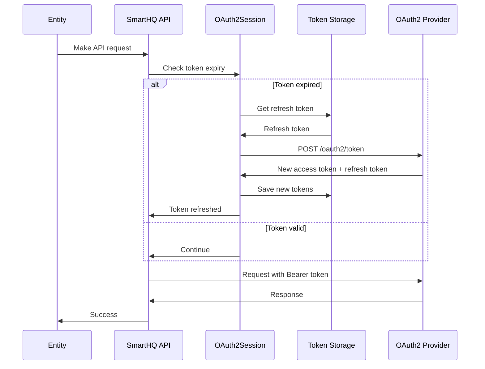
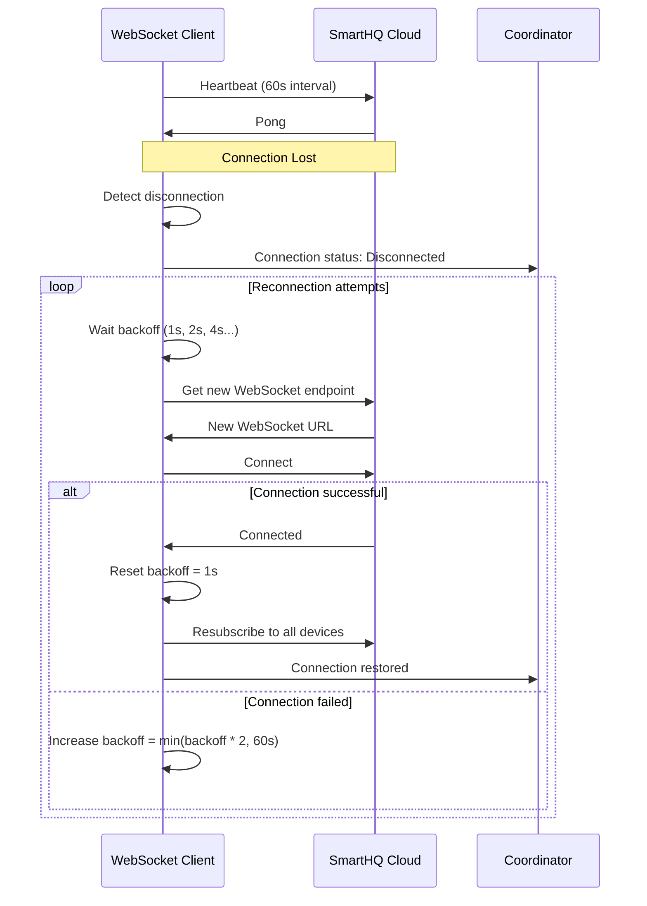
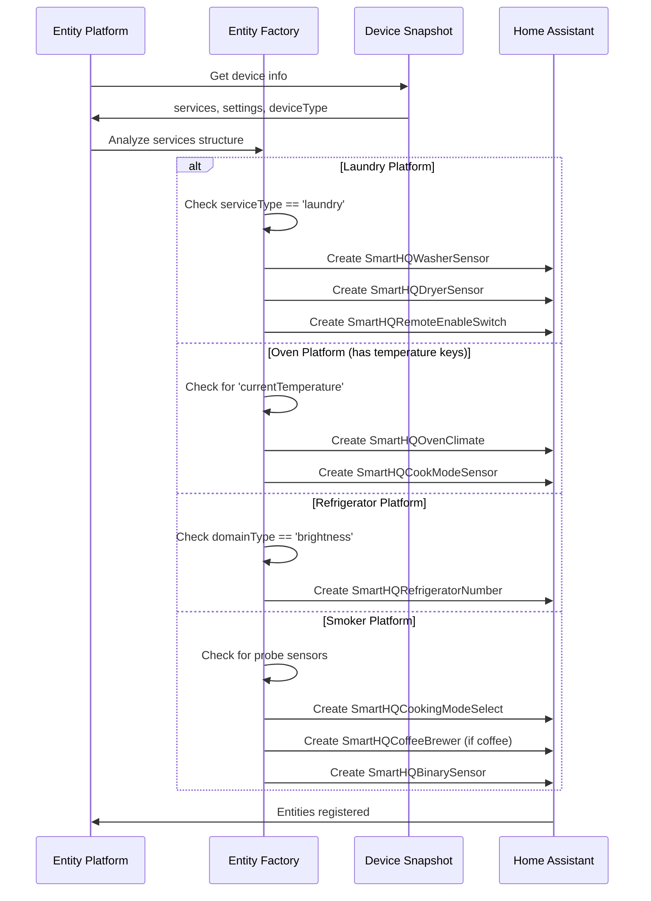
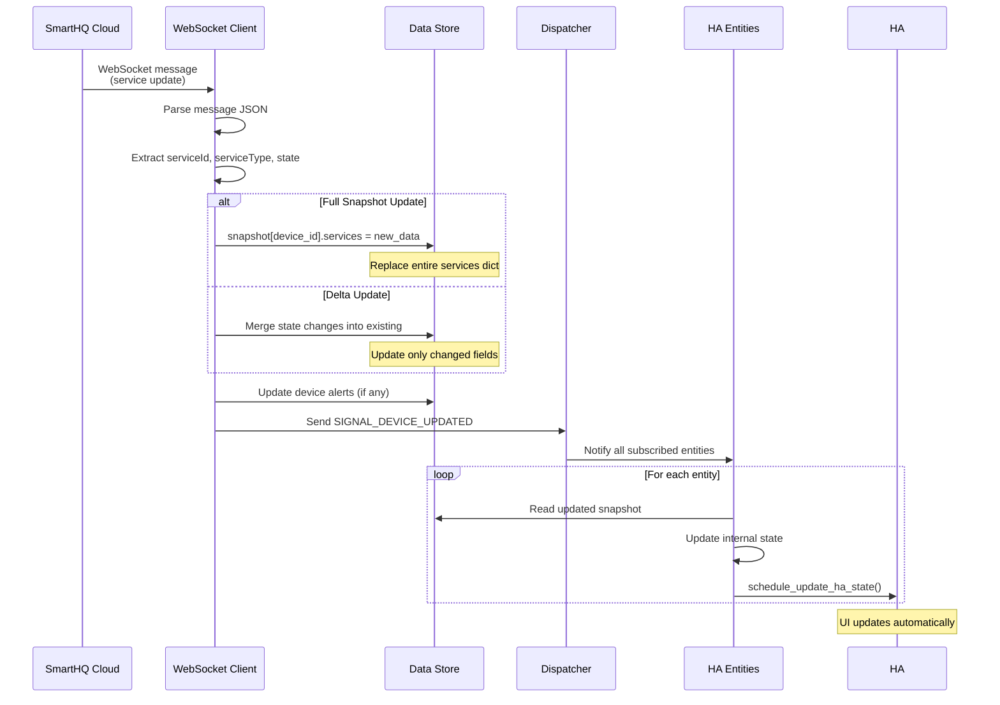

# SmartHQ Integration Sequence Diagrams

This document provides high-level sequence diagrams for the SmartHQ Home Assistant integration. For detailed technical flows, see the [Appendix](#appendix).

## 1. Authentication Flow

**Key Points:**
- Uses OAuth2 authorization code flow
- Tokens stored securely in Home Assistant
- Automatic token refresh when expired

---

## 2. Appliance Control Flow

**Key Points:**
- Commands sent via REST API
- State updates received via WebSocket for real-time sync
- Coordinator manages data flow and entity updates

---

## 3. Use Case: Controlling a Smoker

**Entities Created for Smoker:**
- **Climate Entity**: Target temperature, current temperature, operating mode
- **Sensor Entities**: Probe temperatures, cook time
- **Binary Sensor**: Smoke level, power status
- **Switch**: Remote enable/disable

---

## 4. Initial Setup & Device Discovery

**Entity Platform Mapping:**
- **Laundry**: Sensor (cycle status), Switch (remote enable), Binary Sensor (door lock)
- **Oven**: Climate (temperature), Sensor (cook mode), Binary Sensor (preheat status)
- **Refrigerator**: Number (temperature setpoint), Sensor (door status)
- **Dishwasher**: Sensor (cycle status), Binary Sensor (rinse aid level)
- **Smoker**: Climate (temperature), Sensor (probe temps), Binary Sensor (smoke level)

---

# Appendix

## A1. Detailed OAuth2 Token Refresh Flow

---

## A2. WebSocket Reconnection with Exponential Backoff

---

## A3. Entity Creation Decision Logic

---

## A4. Full Snapshot Update Processing

---

## Notes

- **REST API**: Used for commands and initial data fetch
- **WebSocket**: Used for real-time state updates (more efficient than polling)
- **Coordinator**: Central hub for data management and API coordination
- **Entity Platforms**: sensor, binary_sensor, switch, climate, number, select, button
- **Reconnection**: Automatic with exponential backoff (max 60s)
- **Token Refresh**: Automatic and transparent to user

For implementation details, see the source code in:
- `config_flow.py` - OAuth2 flow
- `coordinator.py` - Data coordination
- `ws_client.py` - WebSocket handling
- `api.py` - REST API calls
- Platform files (`sensor.py`, `switch.py`, etc.) - Entity implementations
