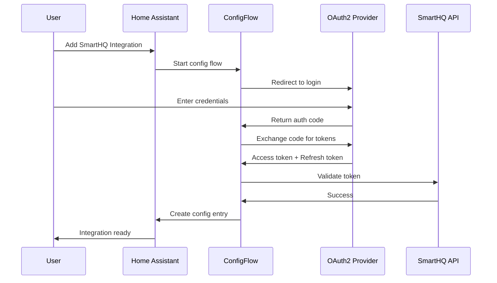
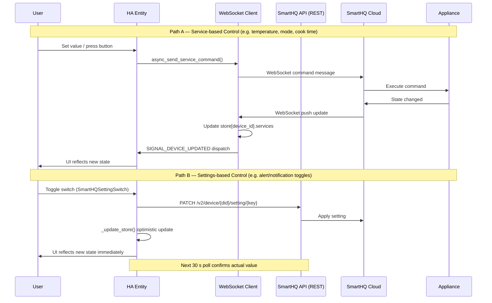
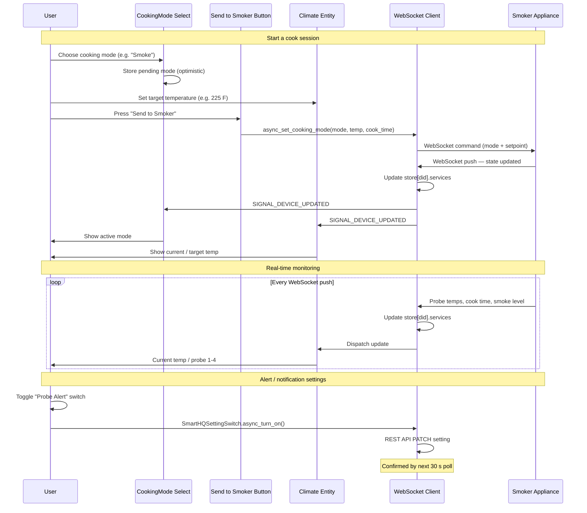
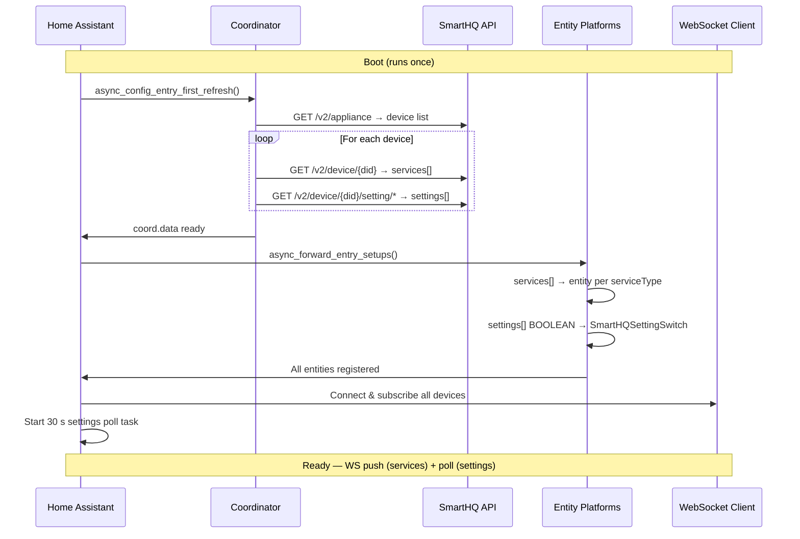
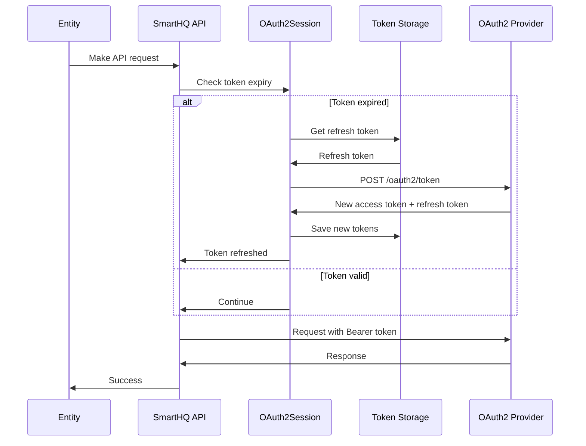
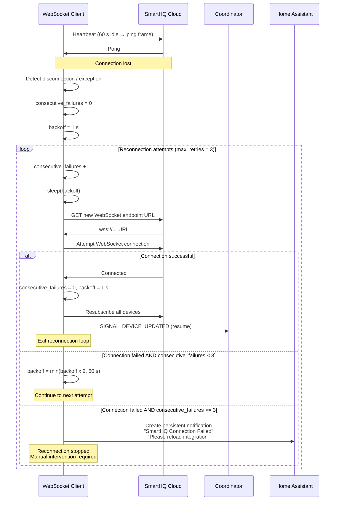
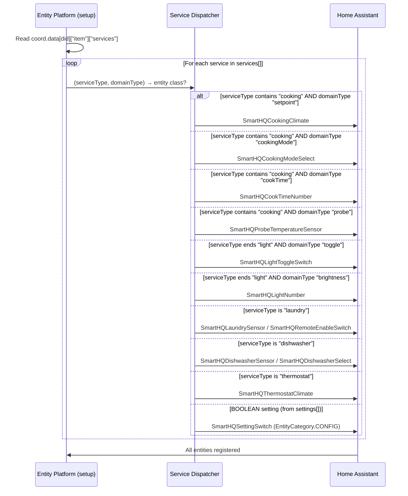
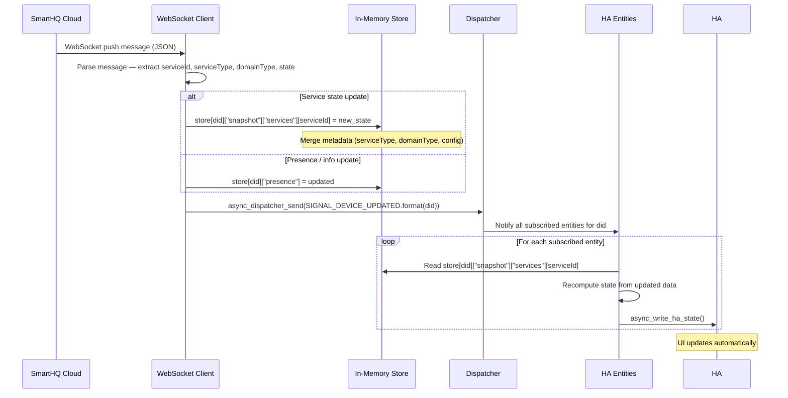

# SmartHQ Integration Sequence Diagrams

This document provides high-level sequence diagrams for the SmartHQ Home Assistant
integration. For detailed technical flows, see the [Appendix](#appendix).

---

## 1. Authentication Flow

**Key Points:**
- Uses OAuth2 authorization code flow
- Tokens stored securely in Home Assistant
- Automatic token refresh when expired

---

## 2. Appliance Control Flow

**Key Points:**
- **Service entities** (climate, select, number, button, sensor): commands go via WebSocket; state updates arrive via WebSocket push
- **Settings entities** (SmartHQSettingSwitch): writes go via REST API; state is refreshed every 30 seconds by background polling task
- No coordinator involvement at runtime — coordinator is boot-only

---

## 3. Use Case: Controlling a Smoker

**Service-Based Entities Created for Smoker:**

| Entity Type | Source | Example |
|-------------|--------|---------|
| `climate` | cooking service (setpoint/currentTemp) | Smoker temperature |
| `select` | cooking mode service | Cooking mode (Smoke / Grill / …) |
| `number` | cook time service | Cook time (minutes) |
| `button` | send command service | Send to Smoker |
| `sensor` | probe / cook time services | Probe 1–4 temps, cook time remaining |
| `binary_sensor` | smoke level service | Smoke level active |
| `switch` (Settings) | REST BOOLEAN settings | Probe alert, door alert, … |

---

## 4. Initial Setup & Device Discovery

**Key Points:**
- `SmartHQCoordinator` runs **once at boot** — no periodic polling schedule
- Entity creation is driven by the `services[]` array; each `serviceType` maps to a specific entity class
- `SmartHQSettingSwitch` entities are created from the `settings[]` array (BOOLEAN type only)
- After boot, state updates flow via WebSocket (service entities) or the 30 s settings poll (setting switches)

---

# Appendix

## A1. Detailed OAuth2 Token Refresh Flow

---

## A2. WebSocket Reconnection with Exponential Backoff

**Backoff Schedule:**

| Attempt | Sleep before attempt |
|---------|----------------------|
| 1 | 1 s |
| 2 | 2 s |
| 3 | 4 s |
| (cap) | max 60 s |

---

## A3. Service-Type → Entity-Class Mapping

---

## A4. WebSocket Message Processing

---

## Notes

- **REST API**: Used for initial boot data fetch (`GET /v2/device/{did}`, `GET /v2/device/{did}/setting/*`) and settings writes (`PATCH`)
- **WebSocket**: Used for real-time service state updates — no polling overhead for service entities
- **Settings Polling**: 30 s background task — required because WebSocket does not push settings changes
- **Coordinator**: Runs only once at boot (`async_config_entry_first_refresh`); no periodic update schedule
- **Entity Platforms**: `sensor`, `binary_sensor`, `switch`, `climate`, `number`, `select`, `button`, `light`, `water_heater`
- **Reconnection**: Automatic with exponential backoff (1 s → 2 s → 4 s), max 3 attempts before persistent notification
- **Token Refresh**: Automatic and transparent to user via `OAuth2Session`

For implementation details, see:
- `config_flow.py` — OAuth2 flow
- `coordinator.py` — One-time boot data fetch
- `__init__.py` — Bootstrap, store wiring, WS start, settings poll
- `ws_client.py` — WebSocket connection, reconnection, command dispatch
- `api.py` — REST API calls
- `switch.py` — `SmartHQSettingSwitch` (settings) + service-based switches
- Platform files (`sensor.py`, `climate.py`, `select.py`, `number.py`, `button.py`, …) — Entity implementations
